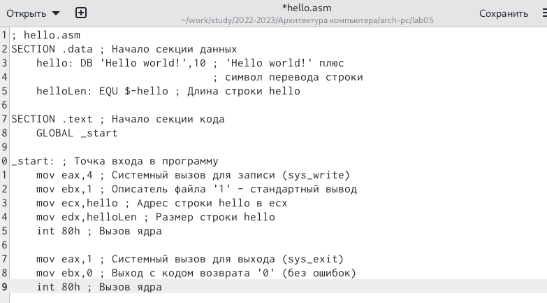
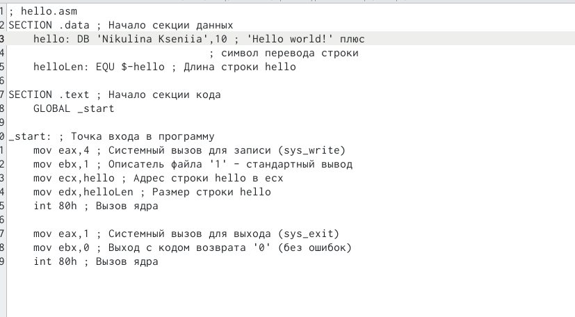

---
## Front matter
title: "Отчет по лабораторной работе № 5"

subtitle: "Дисциплина: Архитектура компьютера"

author: "Никулина Ксения Ильинична"

## Generic otions
lang: ru-RU
toc-title: "Содержание"

## Bibliography
bibliography: bib/cite.bib
csl: pandoc/csl/gost-r-7-0-5-2008-numeric.csl

## Pdf output format
toc: true # Table of contents
toc-depth: 2
lof: true # List of figures
fontsize: 12pt
linestretch: 1.5
papersize: a4
documentclass: scrreprt
## I18n polyglossia
polyglossia-lang:
  name: russian
  options:
	- spelling=modern
	- babelshorthands=true
polyglossia-otherlangs:
  name: english
## I18n babel
babel-lang: russian
babel-otherlangs: english
## Fonts
mainfont: PT Serif
romanfont: PT Serif
sansfont: PT Sans
monofont: PT Mono
mainfontoptions: Ligatures=TeX
romanfontoptions: Ligatures=TeX
sansfontoptions: Ligatures=TeX,Scale=MatchLowercase
monofontoptions: Scale=MatchLowercase,Scale=0.9
## Biblatex
biblatex: true
biblio-style: "gost-numeric"
biblatexoptions:
  - parentracker=true
  - backend=biber
  - hyperref=auto
  - language=auto
  - autolang=other*
  - citestyle=gost-numeric
## Pandoc-crossref LaTeX customization
figureTitle: "Рис."
tableTitle: "Таблица"
listingTitle: "Листинг"
lofTitle: "Список иллюстраций"
lolTitle: "Листинги"
## Misc options
indent: true
header-includes:
  - \usepackage{indentfirst}
  - \usepackage{float} # keep figures where there are in the text
  - \floatplacement{figure}{H} # keep figures where there are in the text
---

# Цель работы

Освоение процедуры компиляции и сборки программ, написанных на ассем-
блере NASM.

# Задание

Освоить процедуры компиляции и сборки программ, написанных на ассемблере NASM.

# Теоретическое введение

 **Язык ассемблера88 (assembly language, сокращённо asm) — машинно-
ориентированный язык низкого уровня. Можно считать, что он больше любых
других языков приближен к архитектуре ЭВМ и её аппаратным возможностям,
что позволяет получить к ним более полный доступ, нежели в языках высокого
уровня, таких как C/C++, Perl, Python и пр. Заметим, что получить полный доступ
к ресурсам компьютера в современных архитектурах нельзя, самым низким
уровнем работы прикладной программы является обращение напрямую к ядру. 
**NASM** — это открытый проект ассемблера, версии которого доступны под
различные операционные системы и который позволяет получать объектные
файлы для этих систем. В NASM используется Intel-синтаксис и поддерживаются
инструкции x86-64
Программа на языке ассемблера также может содержать директивы — ин-
струкции, не переводящиеся непосредственно в машинные команды, а управ-
ляющие работой транслятора. Например, директивы используются для опреде-
ления данных (констант и переменных) и обычно пишутся большими буквами

# Выполнение лабораторной работы

1. Создала каталог для работы с программами на языке ассемблера NASM (рис. [-@fig:001])

{ #fig:001 width=70% }

2. Перешла в созданный каталог (рис. [-@fig:002])

{ #fig:002 width=70% }

3. Создала текстовый файл с именем hello.asm (рис. [-@fig:003])

{ #fig:003 width=70% }

4. Открыла этот файл с помощью текстового редактора gedit и ввела следующий текст (рис. [-@fig:004])

{ #fig:004 width=70% }

5. Для компиляции текста программы «Hello World» написала (рис. [-@fig:005])

{ #fig:005 width=70% }

 
 6. Cкомпилировала исходный файл hello.asm в obj.o и с помощью команды ls проверила, что файлы были созданы (рис. [-@fig:006])

{ #fig:006 width=70% }

7. Объектный файл передала на обработку компоновщику (рис. [-@fig:007])

{ #fig:007 width=70% }

8. Выполнила следующую команду (рис. [-@fig:008])

{ #fig:008 width=70% }

9. Запустила на выполнение созданный исполняемый файл, находящийся в
текущем каталоге,набрав в командной строке: (рис. [-@fig:009])

{ #fig:009 width=70% }

# Выполнение самостоятельной работы 

1. В каталоге ~/work/arch-pc/lab05 с помощью команды cp создала копию
файла hello.asm с именем lab5.asm (рис. [-@fig:010])

{ #fig:010 width=70% }

2. С помощью текстового редактора внесла изменения в текст про-
граммы в файле lab5.asm так, чтобы вместо Hello world! на экран выво-
дилась строка с моими фамилией и именем (рис. [-@fig:011])

{ #fig:011 width=70% }

3. Оттранслировала полученный текст программы lab5.asm в объектный
файл. Выполнила компоновку объектного файла и запустила получивший-
ся исполняемый файл. (рис. [-@fig:012])

{ #fig:012 width=70% }

4. Скопировала файлы hello.asm и lab5.asm в мой локальный репозиторий
в каталог ~/work/study/2022-2023/"Архитектура компьютера"/arch-
pc/labs/lab05/. (рис. [-@fig:013])

{ #fig:013 width=70% }

5. Загрузила файлы на Github(рис. [-@fig:014])

{ #fig:014 width=70% }

# Выводы

В ходе проделанной работы я освоила процедуры компиляции и сборки программ, написанных на ассемблере NASM.

