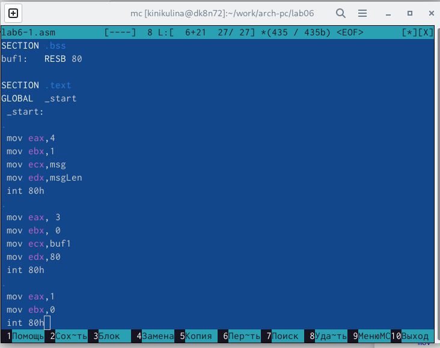

---
## Front matter
title: "Лабораторная работа № 6"
subtitle: "Дисциплина: Архитектура компьютера"
author: "Никулина Ксения Ильинична"

## Generic otions
lang: ru-RU
toc-title: "Содержание"

## Bibliography
bibliography: bib/cite.bib
csl: pandoc/csl/gost-r-7-0-5-2008-numeric.csl

## Pdf output format
toc: true # Table of contents
toc-depth: 2
lof: true # List of figures
fontsize: 12pt
linestretch: 1.5
papersize: a4
documentclass: scrreprt
## I18n polyglossia
polyglossia-lang:
  name: russian
  options:
	- spelling=modern
	- babelshorthands=true
polyglossia-otherlangs:
  name: english
## I18n babel
babel-lang: russian
babel-otherlangs: english
## Fonts
mainfont: PT Serif
romanfont: PT Serif
sansfont: PT Sans
monofont: PT Mono
mainfontoptions: Ligatures=TeX
romanfontoptions: Ligatures=TeX
sansfontoptions: Ligatures=TeX,Scale=MatchLowercase
monofontoptions: Scale=MatchLowercase,Scale=0.9
## Biblatex
biblatex: true
biblio-style: "gost-numeric"
biblatexoptions:
  - parentracker=true
  - backend=biber
  - hyperref=auto
  - language=auto
  - autolang=other*
  - citestyle=gost-numeric
## Pandoc-crossref LaTeX customization
figureTitle: "Рис."
tableTitle: "Таблица"
listingTitle: "Листинг"
lofTitle: "Список иллюстраций"
lolTitle: "Листинги"
## Misc options
indent: true
header-includes:
  - \usepackage{indentfirst}
  - \usepackage{float} # keep figures where there are in the text
  - \floatplacement{figure}{H} # keep figures where there are in the text
---

# Цель работы

Приобретение практических навыков работы в Midnight Commander. Освоение
инструкций языка ассемблера mov и int

# Задание

Освоить инструкции языка ассемблера mov и int.  Приобрести практические навыки работы в Midnight Commander. 

# Теоретическое введение

**Midnight Commander** (или просто mc) — это программа, которая позволяет
просматривать структуру каталогов и выполнять основные операции по управ-
лению файловой системой, т.е. mc является файловым менеджером. Midnight
Commander позволяет сделать работу с файлами более удобной и наглядной. 

Программа на языке ассемблера NASM, как правило, состоит из трёх секций:
секция кода программы (SECTION .text), секция инициированных (известных
во время компиляции) данных (SECTION .data) и секция неинициализирован-
ных данных (тех, под которые во время компиляции только отводится память,
а значение присваивается в ходе выполнения программы) (SECTION .bss).

Инструкция языка ассемблера intпредназначена для вызова прерывания с
указанным номером. В общем виде она записывается в виде
int n
Здесь n — номер прерывания, принадлежащий диапазону 0–255

# Выполнение лабораторной работы

1. Открыла Midnight Commander (рис. [-@fig:001])

{ #fig:001 width=70% }

2.  Пользуясь клавишами ↑ , ↓ и Enter перешла в каталог ~/work/arch-
pc созданный при выполнении лабораторной работы №5 и с помощью функциональной клавиши F7 создала папку lab06  (рис. [-@fig:002])

{ #fig:002 width=70% }

3. Пользуясь строкой ввода и командой touch создала файл lab6-1.asm (рис. [-@fig:003])

{ #fig:003 width=70% }

4. С помощью функциональной клавиши F4 открыла файл lab6-1.asm для редактирования во встроенном редакторе. Ввела текст программы из листинга 6.1, сохранила изменения и закрыла файл.(рис. [-@fig:004])

{ #fig:004 width=70% }

5. Оттранслировала текст программы lab6-1.asm в объектный файл. Выполнила компоновку объектного файла и запустила получившийся исполняемый файл. Программа вывела строку 'Введите строку:' и на запрос ввела мои ФИ. (рис. [-@fig:005])

{ #fig:005 width=70% }

6. Скачала файл in_out.asm со страницы курса в ТУИС  (рис. [-@fig:006])

{ #fig:006 width=70% }

7. С помощью функциональной клавиши F5 создайте копию файла lab6-
1.asm с именем lab6-2.asm. (рис. [-@fig:007])

{ #fig:007 width=70% }

8. Исправила текст программы в файле lab6-2.asm с использование подпрограмм из внешнего файла in_out.asm в соответствии с листингом 6.2.Создала исполняемый файл и проверила его работу. (рис. [-@fig:008])

{ #fig:008 width=70% }

9. В файле lab6-2.asm заменила подпрограмму sprintLF на sprint.  (рис. [-@fig:009])

{ #fig:009 width=70% }

10.  Создала исполняемый файл и проверила его работу. (рис. [-@fig:010])

{ #fig:010 width=70% }

# Выполнение самостоятельной работы 

1. Создала  копию файла lab6-1.asm под именем lab6-3.asm. Внесла изменения в программу (без
использования внешнего файла in_out.asm), так чтобы она работала по
следующему алгоритму:
• вывести приглашение типа “Введите строку:”;
• ввести строку с клавиатуры;
• вывести введённую строку на экран (рис. [-@fig:011])

 { #fig:011 width=70% }
 
 2. Получила исполняемый файл и проверила его работу. На приглашение ввести строку ввела свою фамилию и имя (рис. [-@fig:012])
 
 { #fig:012 width=70% }
 
3.  Создала копию файла lab6-2.asm под именем lab6-2_2.asm. Исправила текст программы с использованием подпрограмм из внешнего файла in_out.asm, так чтобы она работала по следующему алгоритму:
• вывести приглашение типа “Введите строку:”;
• ввести строку с клавиатуры;
• вывести введённую строку на экран. (рис. [-@fig:013])

{ #fig:013 width=70% }

4. Создала исполняемый файл и проверила его работу (рис. [-@fig:014])

{ #fig:014 width=70% }

# Выводы

Приобрела практические навыки работы в Midnight Commander. Освоила инструкций языка ассемблера mov и int

