---
## Front matter
title: "Отчет по лабораторной работе № 7"
subtitle: "Дисциплина: Архитектура данных"
author: "Никулина Ксения Ильинична"

## Generic otions
lang: ru-RU
toc-title: "Содержание"

## Bibliography
bibliography: bib/cite.bib
csl: pandoc/csl/gost-r-7-0-5-2008-numeric.csl

## Pdf output format
toc: true # Table of contents
toc-depth: 2
lof: true # List of figures
fontsize: 12pt
linestretch: 1.5
papersize: a4
documentclass: scrreprt
## I18n polyglossia
polyglossia-lang:
  name: russian
  options:
	- spelling=modern
	- babelshorthands=true
polyglossia-otherlangs:
  name: english
## I18n babel
babel-lang: russian
babel-otherlangs: english
## Fonts
mainfont: PT Serif
romanfont: PT Serif
sansfont: PT Sans
monofont: PT Mono
mainfontoptions: Ligatures=TeX
romanfontoptions: Ligatures=TeX
sansfontoptions: Ligatures=TeX,Scale=MatchLowercase
monofontoptions: Scale=MatchLowercase,Scale=0.9
## Biblatex
biblatex: true
biblio-style: "gost-numeric"
biblatexoptions:
  - parentracker=true
  - backend=biber
  - hyperref=auto
  - language=auto
  - autolang=other*
  - citestyle=gost-numeric
## Pandoc-crossref LaTeX customization
figureTitle: "Рис."
tableTitle: "Таблица"
listingTitle: "Листинг"
lofTitle: "Список иллюстраций"
lolTitle: "Листинги"
## Misc options
indent: true
header-includes:
  - \usepackage{indentfirst}
  - \usepackage{float} # keep figures where there are in the text
  - \floatplacement{figure}{H} # keep figures where there are in the text
---

# Цель работы

Освоение арифметических инструкций языка ассемблера NASM

# Задание
Освоить арифметические инструкций языка ассемблера NASM

# Теоретическое введение

Большинство инструкций на языке ассемблера требуют обработки операндов.
Адрес операнда предоставляет место, где хранятся данные, подлежащие обработке. Это могут быть данные хранящиеся в регистре или в ячейке памяти. Далее
рассмотрены все существующие способы задания адреса хранения операндов способы адресации.
Существует три основных способа адресации:
• Регистровая адресация – операнды хранятся в регистрах и в команде
используются имена этих регистров, например: mov ax,bx.
• Непосредственная адресация – значение операнда задается непосредственно в команде, Например: mov ax,2.
• Адресация памяти – операнд задает адрес в памяти. В команде указывается символическое обозначение ячейки памяти, над содержимым которой требуется выполнить операцию

Для выполнения лабораторных работ в файле in_out.asm реализованы подпрограммы для преобразования ASCII символов в числа и обратно. Это:
• iprint – вывод на экран чисел в формате ASCII, перед вызовом iprint в регистр eax необходимо записать выводимое число (mov eax,<int>).
• iprintLF – работает аналогично iprint, но при выводе на экран после числа добавляет к символ перевода строки.
• atoi – функция преобразует ascii-код символа в целое число и записает результат в регистр eax, перед вызовом atoi в регистр eax необходимо записать число (mov eax,<int>).

# Выполнение лабораторной работы

1. Создала каталог для программам лабораторной работы №7,перешла в него и создала файл lab7-1.asm (рис. [-@fig:001])

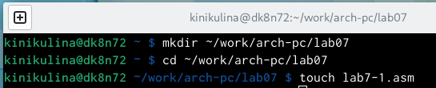{ #fig:001 width=70% }

2. Ввела в файл lab7-1.asm текст программы из листинга 7.1. (рис. [-@fig:002])

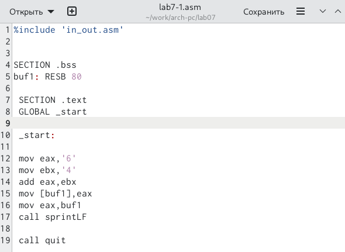{ #fig:002 width=70% }

3. Создала исполняемый файл и запустила его. (рис. [-@fig:003])

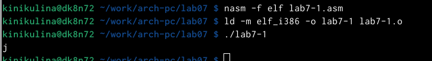{ #fig:003 width=70% }

4. Далее изменила текст программы и вместо символов записал в реги-
стры числа. (рис. [-@fig:004])

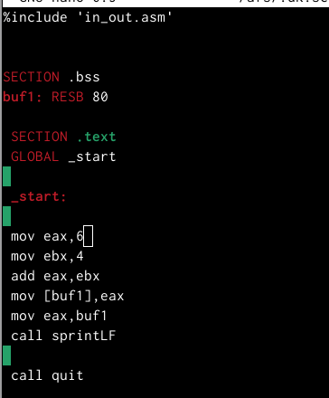{ #fig:004 width=70% }

5. Создала исполняемый файл и запустила его. (рис. [-@fig:005])

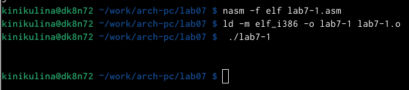{ #fig:005 width=70% }

6. Cоздала файл lab7-2.asm (рис. [-@fig:006])

{ #fig:006 width=70% }

7. Ввела в него текст программы из листинга 7.2 (рис. [-@fig:007])

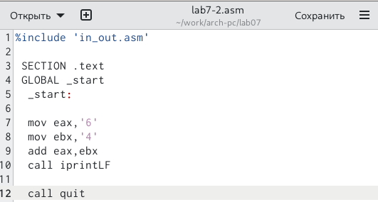{ #fig:007 width=70% }

8. Создала исполняемый файл и запустила его. (рис. [-@fig:008])

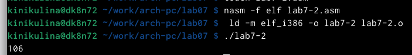{ #fig:008 width=70% }

9. Аналогично предыдущему примеру изменила символы на числа. (рис. [-@fig:009])

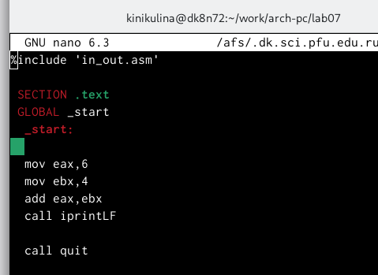{ #fig:009 width=70% }

10. Создала исполняемый файл и запустила его. (рис. [-@fig:010])

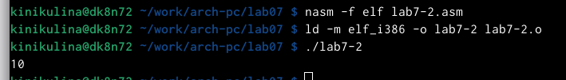{ #fig:010 width=70% }

11. Заменила функцию iprintLF на iprint. (рис. [-@fig:011])

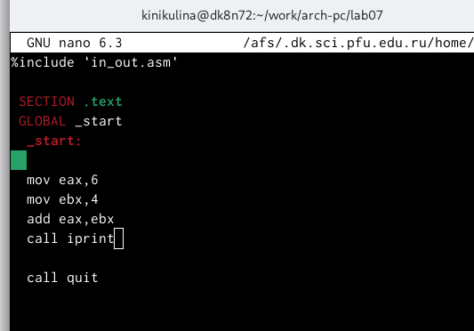{ #fig:011 width=70% }

12. Создала исполняемый файл и запустила его. (рис. [-@fig:012])

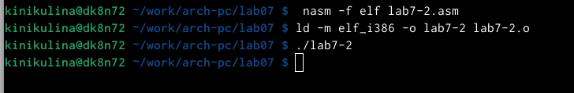{ #fig:012 width=70% }

13. Создала файл lab7-3.asm в каталоге ~/work/arch-pc/lab07 (рис. [-@fig:013])

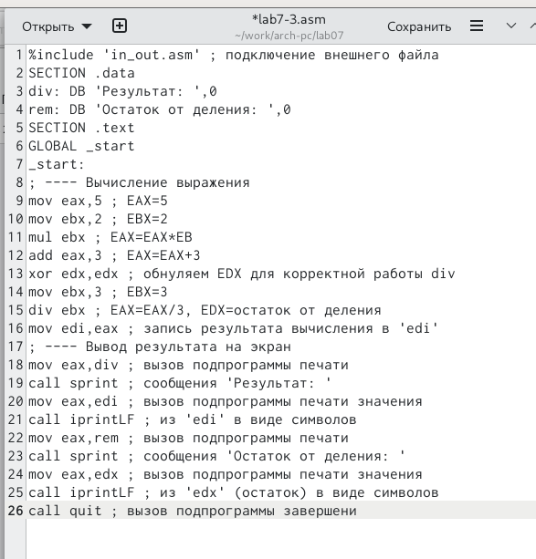{ #fig:013 width=70% }

14. Создала исполняемый файл и запустила его. (рис. [-@fig:014])

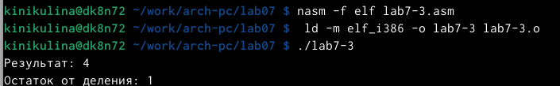{ #fig:014 width=70% }

15. Изменила текст программы для вычисления выражения 𝑓(𝑥) = (4 ∗ 6 + 2)/5 (рис. [-@fig:015])

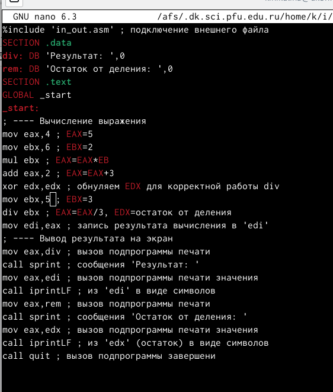{ #fig:015 width=70% }

16. Создала исполняемый файл и запустила его. (рис. [-@fig:016])

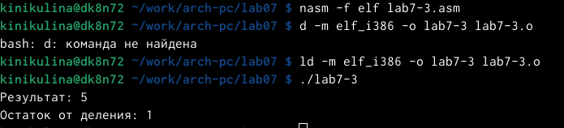{ #fig:016 width=70% }

17. Создала файл variant.asm в каталоге ~/work/arch-pc/lab07 (рис. [-@fig:017])

{ #fig:017 width=70% }

18. Ввела в файле текст (рис. [-@fig:018])

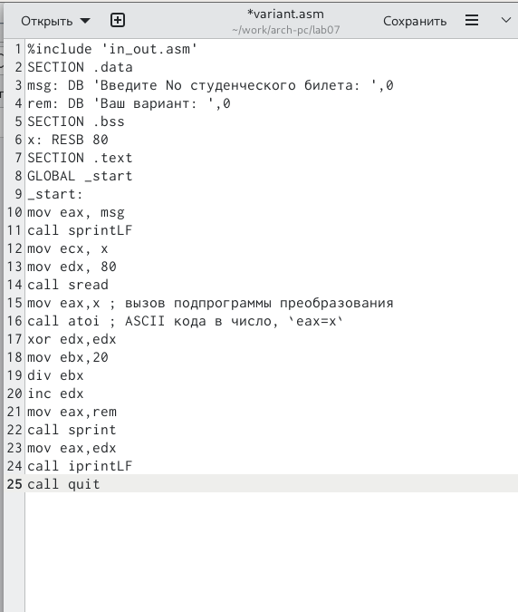{ #fig:018 width=70% }

19. Создала исполняемый файл и запустила его. (рис. [-@fig:019])

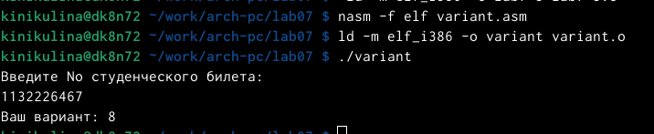{ #fig:019 width=70% }

# Самостоятельная работа

1. Создала файл для самостотельной работы (рис. [-@fig:020])

{ #fig:020 width=70% }

2. Ввела программу, которая будет решать уравнение (11 + 𝑥) ⋅ 2 − 6 (рис. [-@fig:021])

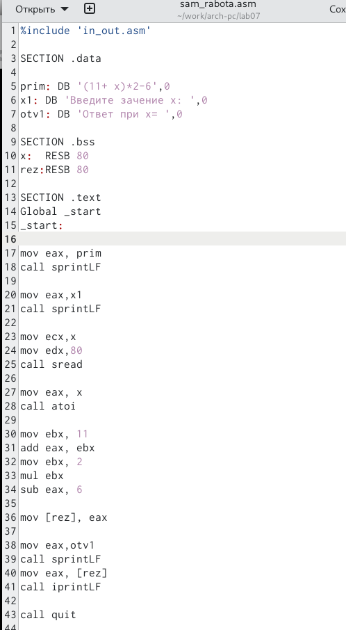{ #fig:021 width=70% }

3. Создала исполняемый файл и запустила его. (рис. [-@fig:022], рис. [-@fig:023])

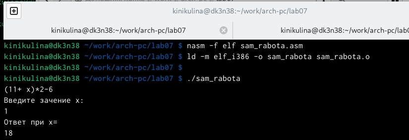{ #fig:022 width=70% }

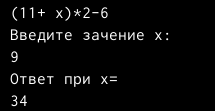{ #fig:023 width=70% }

# Ответы на впросы
1. Какие строки листинга 7.4 отвечают за вывод на экран сообщения ‘Ваш вариант:’?
mov eax,msg call sprintLF
2. Для чего используется следующие инструкции? nasm mov ecx, x mov edx, 80 call sread
Эти инструкции используются для ввода переменной Х с клавиатуры и сохранения введенных данных.
3. Для чего используется инструкция “call atoi”?
Эта инструкция используется для преобразования Кода переменной ASCII в число.
4. Какие строки листинга 7.4 отвечают за вычисления варианта?
mov ebx,20 div ebx inc edx
5. В какой регистр записывается остаток от деления при выполнении инструкции “div ebx”?
В регистре ebx.
6.  Для чего используется инструкция “inc edx”?
Для увеличения значения edx на 1.
7. Какие строки листинга 7.4 отвечают за вывод на экран результата вычислений?
mov eax,edx call iprintLF

# Выводы

Я освоила арифметические инструкции языка ассемблера NASM

