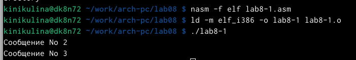
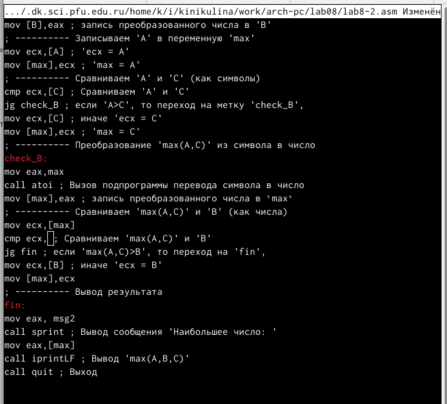

---
## Front matter
title: "Отчет по лабораторной работе № 8"
subtitle: "Дисциплина: архитектура компьютера"
author: "Никулина Ксения Ильинична"

## Generic otions
lang: ru-RU
toc-title: "Содержание"

## Bibliography
bibliography: bib/cite.bib
csl: pandoc/csl/gost-r-7-0-5-2008-numeric.csl

## Pdf output format
toc: true # Table of contents
toc-depth: 2
lof: true # List of figures
fontsize: 12pt
linestretch: 1.5
papersize: a4
documentclass: scrreprt
## I18n polyglossia
polyglossia-lang:
  name: russian
  options:
	- spelling=modern
	- babelshorthands=true
polyglossia-otherlangs:
  name: english
## I18n babel
babel-lang: russian
babel-otherlangs: english
## Fonts
mainfont: PT Serif
romanfont: PT Serif
sansfont: PT Sans
monofont: PT Mono
mainfontoptions: Ligatures=TeX
romanfontoptions: Ligatures=TeX
sansfontoptions: Ligatures=TeX,Scale=MatchLowercase
monofontoptions: Scale=MatchLowercase,Scale=0.9
## Biblatex
biblatex: true
biblio-style: "gost-numeric"
biblatexoptions:
  - parentracker=true
  - backend=biber
  - hyperref=auto
  - language=auto
  - autolang=other*
  - citestyle=gost-numeric
## Pandoc-crossref LaTeX customization
figureTitle: "Рис."
listingTitle: "Листинг"
lofTitle: "Список иллюстраций"
lotTitle: "Список таблиц"
lolTitle: "Листинги"
## Misc options
indent: true
header-includes:
  - \usepackage{indentfirst}
  - \usepackage{float} # keep figures where there are in the text
  - \floatplacement{figure}{H} # keep figures where there are in the text
---

# Цель работы

Изучение команд условного и безусловного переходов. Приобретение навы-
ков написания программ с использованием переходов. Знакомство с назначе-
нием и структурой файла листинг

# Задание

Изучить команды условного и безусловного переходов. Приобрести навыки написания программ с использованием переходов. Познакомиться с назначением и структурой файла листинга

# Теоретическое введение

Для реализации ветвлений в ассемблере используются так называемые ко-
манды передачи управления или команды перехода. Можно выделить 2 типа
переходов:
• условный переход – выполнение или не выполнение перехода в определен-
ную точку программы в зависимости от проверки условия.
• безусловный переход – выполнение передачи управления в определенную
точку программы без каких-либо условий.

Все ошибки и предупреждения, обнаруженные при ассемблировании, транслятор выводит на экран, и файл листинга не создаётся.
Итак, структура листинга:
• номер строки — это номер строки файла листинга (нужно помнить, что номер строки в файле листинга может не соответствовать номеру строки
в файле с исходным текстом программы);
• адрес — это смещение машинного кода от начала текущего сегмента;
• машинный код представляет собой ассемблированную исходную строку в виде шестнадцатеричной последовательности. (например, инструкция int 80h начинается по смещению 00000020 в сегменте кода; далее идёт машинный код, в который ассемблируется инструкция, то есть инструкция int 80h ассемблируется в CD80 (в шестнадцатеричном представлении);
CD80 — это инструкция на машинном языке, вызывающая прерывание
ядра);
• исходный текст программы — это просто строка исходной программы вместе с комментариями (некоторые строки на языке ассемблера, например, строки, содержащие только комментарии, не генерируют никакого машинного кода, и поля «смещение» и «исходный текст программы» в таких строках отсутствуют, однако номер строки им присваивается).

# Выполнение лабораторной работы

1. Создала каталог для программам лабораторной работы No 8, перешла в него и создала файл lab8-1.asm(рис. [-@fig:001])

{ #fig:001 width=70% }

2. Ввела в файл lab8-1.asm текст программы из листинга 8.1.(рис. [-@fig:002])

{ #fig:002 width=70% }

3. Создала исполняемый файл и проверила его работу(рис. [-@fig:003])

{ #fig:003 width=70% }

4. Изменила текст программы в соответствии с листингом 8.2. Создала исполняемый файл и проверила его работу. (рис. [-@fig:004],рис. [-@fig:005] )

{ #fig:004 width=70% }

{ #fig:005 width=70% }

5. Изменила текст программы, чтобы вывод программы был следующим: (рис. [-@fig:006],рис. [-@fig:007] )

{ #fig:006 width=70% }

{ #fig:007 width=70% }

6. Создала файл lab8-2.asm в каталоге ~/work/arch-pc/lab08  (рис. [-@fig:008])

{ #fig:008 width=70% }

7. Ввела в файл текст из листинга 8.3, создала исполняемый файл и проферила работу (рис. [-@fig:009],рис. [-@fig:010] )

{ #fig:009 width=70% }

{ #fig:010 width=70% }

8. Открыла файл с программой lab8-2.asm и в любой инструкции с двумя операндами удалила один операнд,выполнила трансляцию с получением файла
листинга (рис. [-@fig:011],рис. [-@fig:012] )

{ #fig:011 width=70% }

{ #fig:012 width=70% }

#Самостоятельная работа (Вариант № 8)
1. Написала программу нахождения наименьшей из 3 целочисленных переменных a, b и с (52,33,40) (Ответ: 33)   (рис. [-@fig:013])

{ #fig:013 width=70% }

2. Создала исполняемый файл и проверила его работу(рис. [-@fig:014])

{ #fig:014 width=70% }

3. Напиcала программу, которая для введенных с клавиатуры значений x и a вычисляет значение заданной функции f(x) и выводит результат вычислений. (рис. [-@fig:015])

{ #fig:015 width=70% }

4. Создала исполняемый файл и проверила его работу(рис. [-@fig:016])

{ #fig:016 width=70% }

# Вывод

Я изучила команды условного и безусловного переходов. Приобрела навыки написания программ с использованием переходов. Познакомилпсь с назначением и структурой файла листинг

