---
## Front matter
title: "Лабораторная работа № 9"
subtitle: "Дисциплина: Архитектура компьютера"
author: "Никулина Ксения Ильинична"

## Generic otions
lang: ru-RU
toc-title: "Содержание"

## Bibliography
bibliography: bib/cite.bib
csl: pandoc/csl/gost-r-7-0-5-2008-numeric.csl

## Pdf output format
toc: true # Table of contents
toc-depth: 2
lof: true # List of figures
fontsize: 12pt
linestretch: 1.5
papersize: a4
documentclass: scrreprt
## I18n polyglossia
polyglossia-lang:
  name: russian
  options:
	- spelling=modern
	- babelshorthands=true
polyglossia-otherlangs:
  name: english
## I18n babel
babel-lang: russian
babel-otherlangs: english
## Fonts
mainfont: PT Serif
romanfont: PT Serif
sansfont: PT Sans
monofont: PT Mono
mainfontoptions: Ligatures=TeX
romanfontoptions: Ligatures=TeX
sansfontoptions: Ligatures=TeX,Scale=MatchLowercase
monofontoptions: Scale=MatchLowercase,Scale=0.9
## Biblatex
biblatex: true
biblio-style: "gost-numeric"
biblatexoptions:
  - parentracker=true
  - backend=biber
  - hyperref=auto
  - language=auto
  - autolang=other*
  - citestyle=gost-numeric
## Pandoc-crossref LaTeX customization
figureTitle: "Рис."
listingTitle: "Листинг"
lofTitle: "Список иллюстраций"
lotTitle: "Список таблиц"
lolTitle: "Листинги"
## Misc options
indent: true
header-includes:
  - \usepackage{indentfirst}
  - \usepackage{float} # keep figures where there are in the text
  - \floatplacement{figure}{H} # keep figures where there are in the text
---

# Цель работы

Приобретение навыков написания программ с использованием циклов и обработкой аргументов командной строки

# Задание

Приобрести навыки написания программ с использованием циклов и обработкой аргументов командной строки

# Теоретическое введение

Стек — это структура данных, организованная по принципу LIFO («Last In
— First Out» или «последним пришёл — первым ушёл»). Стек является частью
архитектуры процессора и реализован на аппаратном уровне. Для работы со
стеком в процессоре есть специальные регистры (ss, bp, sp) и команды.
Основной функцией стека является функция сохранения адресов возврата
и передачи аргументов при вызове процедур. Кроме того, в нём выделяется
память для локальных переменных и могут временно храниться значения регистров.

Команда push размещает значение в стеке, т.е. помещает значение в ячейку
памяти, на которую указывает регистр esp, после этого значение регистра esp
увеличивается на 4. Данная команда имеет один операнд — значение, которое
необходимо поместить в стек.

Иструкция loop выполняется в два этапа. Сначала из регистра ecx вычитается
единица и его значение сравнивается с нулём. Если регистр не равен нулю,
то выполняется переход к указанной метке. Иначе переход не выполняется и
управление передаётся команде, которая следует сразу после команды loop.

# Выполнение лабораторной работы

1. Создала каталог для программам лабораторной работы No 9, перешла в него и создайте файл lab9-1.asm: (рис. [-@fig:001])

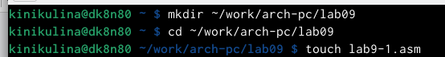{ #fig:001 width=70% }

2. Ввела в файл lab9-1.asm текст программы из листинга 9.1. Создала исполняемый файл и проверила его работу(рис. [-@fig:002],рис. [-@fig:003] )

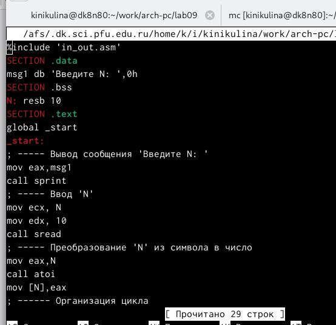{ #fig:002 width=70% }

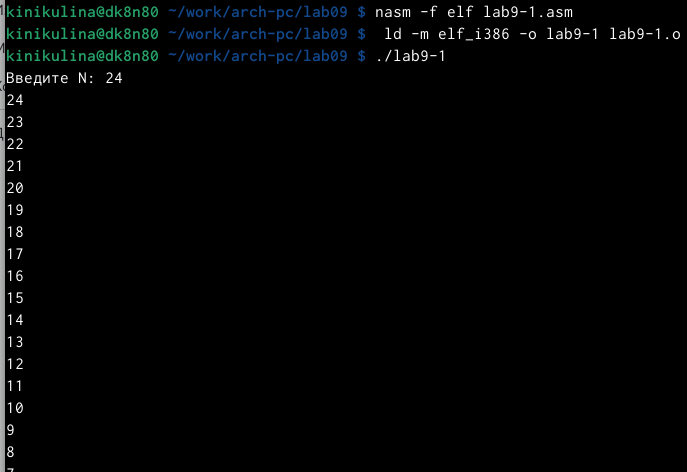{ #fig:003 width=70% }

3. Изменила текст программы добавив изменение значение регистра ecx в цикле (рис. [-@fig:004])

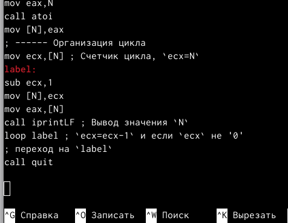{ #fig:004 width=70% }

4. Создала исполняемый файл и проверила его работ (рис. [-@fig:005])

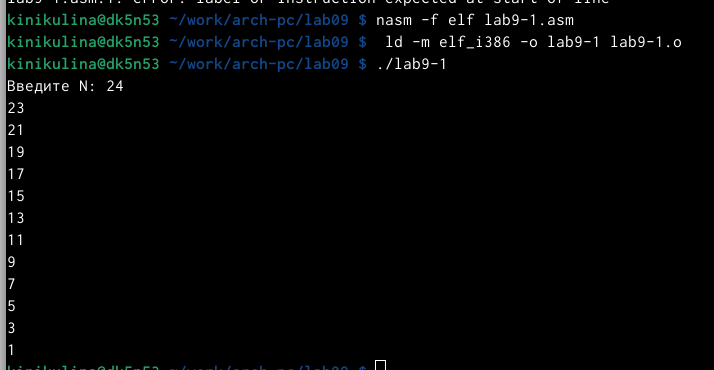{ #fig:005 width=70% }

5. Внесла изменения в текст программы добавив команды push и pop (добавления в стек и извлечения из стека) для сохранения значения счетчика цикла loop. Создала исполняемый файл и проверила его работу. (рис. [-@fig:006])

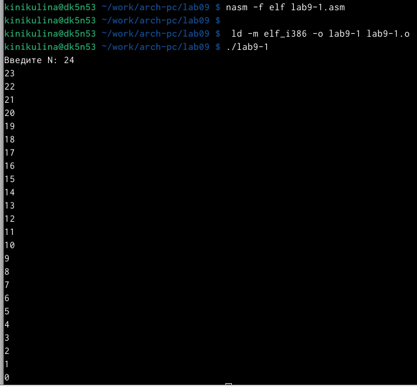{ #fig:006 width=70% }

6. Создайте файл lab9-2.asm в каталоге ~/work/arch-pc/lab09 и введите в него текст программы из листинга 9.2. (рис. [-@fig:007],рис. [-@fig:008] )

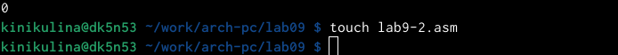{ #fig:007 width=70% }

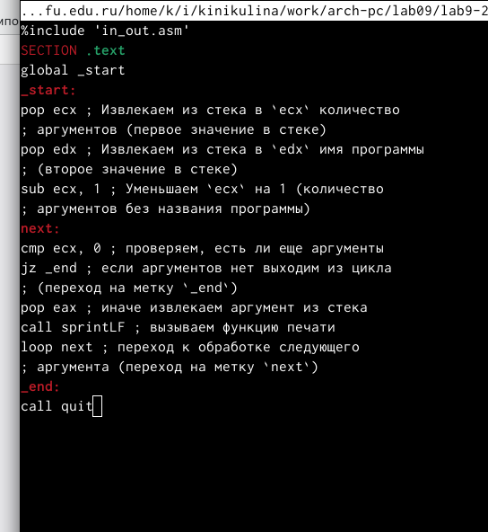{ #fig:008 width=70% }

7. Создала исполняемый файл и запустила его, указав аргументы: user@dk4n31:~$ ./lab9-2 аргумент1 аргумент 2 'аргумент 3' (рис. [-@fig:009])

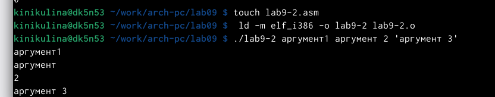{ #fig:009 width=70% }

9. Создайте файл lab9-3.asm в каталоге ~/work/arch-pc/lab09 и введите в него текст программы из листинга 9.3 (рис. [-@fig:010],рис. [-@fig:011] )

{ #fig:010 width=70% }

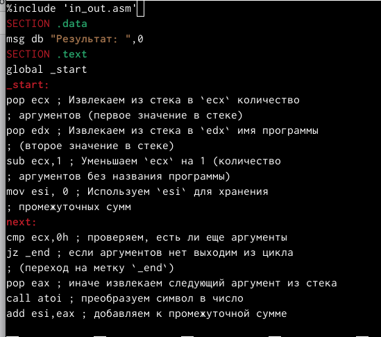{ #fig:011 width=70% }

10. Создала исполняемый файл и запустила его, указав аргументы (рис. [-@fig:012])

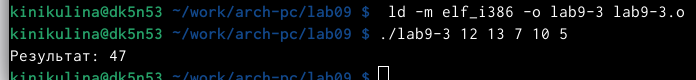{ #fig:012 width=70% }

11. Изменила текст программы из листинга 9.3 для вычисления произведения аргументов командной строки. Создала исполняемый файл и запустила его, указав аргументы. рис. [-@fig:013],рис. [-@fig:014] )

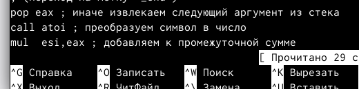{ #fig:013 width=70% }

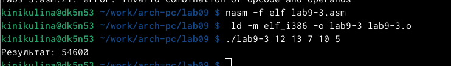{ #fig:014 width=70% }

#Самостоятельная работа

1. Написала программу, которая находит сумму значений функции f(x) для x = x1, x2, ..., xn, т.е. программа должна выводить значение f(x1) + f(x2)+...+f(xn) (f(x) = 7 + 2x) (рис. [-@fig:015])

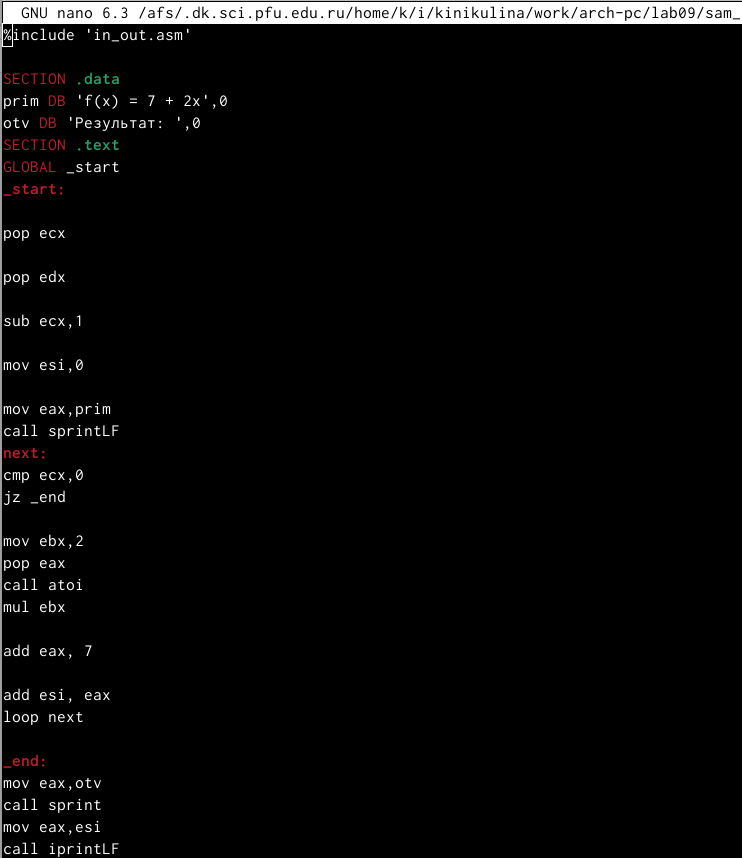{ #fig:015 width=70% }

2. Создала исполняемый файл и запустила его, указав аргументы (рис. [-@fig:016])

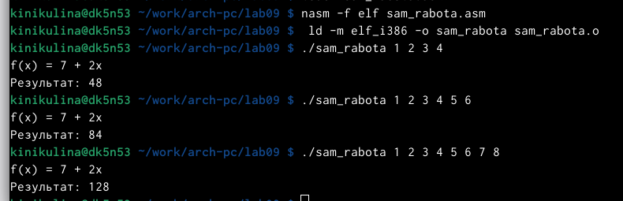{ #fig:016 width=70% }

#Выводы
Я приобрела навыки написания программ с использованием циклов и обработкой аргументов командной строки

