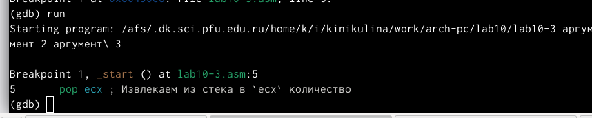

---
## Front matter
title: "Отчет по лабораторной работе №10"
subtitle: "Дисциплина: Архитектура компьютера "
author: "Никулина Ксения Ильинична"

## Generic otions
lang: ru-RU
toc-title: "Содержание"

## Bibliography
bibliography: bib/cite.bib
csl: pandoc/csl/gost-r-7-0-5-2008-numeric.csl

## Pdf output format
toc: true # Table of contents
toc-depth: 2
lof: true # List of figures
lot: true # List of tables
fontsize: 12pt
linestretch: 1.5
papersize: a4
documentclass: scrreprt
## I18n polyglossia
polyglossia-lang:
  name: russian
  options:
	- spelling=modern
	- babelshorthands=true
polyglossia-otherlangs:
  name: english
## I18n babel
babel-lang: russian
babel-otherlangs: english
## Fonts
mainfont: PT Serif
romanfont: PT Serif
sansfont: PT Sans
monofont: PT Mono
mainfontoptions: Ligatures=TeX
romanfontoptions: Ligatures=TeX
sansfontoptions: Ligatures=TeX,Scale=MatchLowercase
monofontoptions: Scale=MatchLowercase,Scale=0.9
## Biblatex
biblatex: true
biblio-style: "gost-numeric"
biblatexoptions:
  - parentracker=true
  - backend=biber
  - hyperref=auto
  - language=auto
  - autolang=other*
  - citestyle=gost-numeric
## Pandoc-crossref LaTeX customization
figureTitle: "Рис."
tableTitle: "Таблица"
listingTitle: "Листинг"
lofTitle: "Список иллюстраций"
lotTitle: "Список таблиц"
lolTitle: "Листинги"
## Misc options
indent: true
header-includes:
  - \usepackage{hyperref}
  - \usepackage{indentfirst}
  - \usepackage{float} # keep figures where there are in the text
  - \floatplacement{figure}{H} # keep figures where there are in the text
---

# Цель работы

Приобретение навыков написания программ с использованием подпрограмм.
Знакомство с методами отладки при помощи GDB и его основными возможно-
стями.

# Задание

Приобрести навыки написания программ с использованием подпрограмм. Познакомиться с методами отладки при помощи GDB и его основными возможностями.

# Теоретическое введение

Отладка — это процесс поиска и исправления ошибок в программе. В общем случае его можно разделить на четыре этапа:
• обнаружение ошибки;
• поиск её местонахождения;
• определение причины ошибки;
• исправление ошибки.
Точки останова — это специально отмеченные места в программе, в которых программа-отладчик приостанавливает выполнение программы и ждёт команд.
Подпрограмма — это, как правило, функционально законченный участок кода, который можно многократно вызывать из разных мест программы. В отличие от
простых переходов из подпрограмм существует возврат на команду, следующую за вызовом.

# Выполнение лабораторной работы

1.  Создала каталог для выполнения лабораторной работы No 10, перешла в него и создала файл lab10-1.asm (рис. [-@fig:001])

{ #fig:001 width=70% }

2.  Ввела  в файл lab10-1.asm текст программы из листинга 10.1. Создала исполняемый файл и проверила его работу(рис. [-@fig:002], рис.[-@fig:003] )

{ #fig:002 width=70% }

{ #fig:003 width=70% }

3. Изменила текст программы, добавив подпрограмму _subcalcul в подпрограмму _calcul, для вычисления выражения f(g(x)), где x вводится с клавиатуры, f(x) = 2x + 7, g(x) = 3x − 1.Создала исполняемый файл и проверила его работу (рис. [-@fig:004], рис.[-@fig:005] )

{ #fig:004 width=70% }

{ #fig:005 width=70% }

4. Создала файл lab10-2.asm с текстом программы из Листинга 10.2 (рис. [-@fig:006], рис.[-@fig:007] )

{ #fig:006 width=70% }

{ #fig:007 width=70% }

5. Загрузила исполняемый файл в отладчик gdb (рис. [-@fig:008])

{ #fig:008 width=70% }

6. Загрузила исполняемый файл в отладчик gdb. Проверила работу программы, запустив ее в оболочке GDB с помощью команды run (рис. [-@fig:009] )

{ #fig:009 width=70% }

7. Для более подробного анализа программы установила брейкпоинт на метку _start, с которой начинается выполнение любой ассемблерной программы, и запустила её (рис. [-@fig:010] )

{ #fig:010 width=70% }

8. Посмотрела дисассимилированный код программы с помощью команды disassemble начиная с метки _start (рис. [-@fig:011] )

{ #fig:011 width=70% }

9. Переключилась на отображение команд с Intel’овским синтаксисом, введя команду set disassembly-flavor intel (рис. [-@fig:012] )

{ #fig:012 width=70% }

10. Включил режим псевдографики для более удобного анализа программы (рис. [-@fig:013], рис.[-@fig:014] )

{ #fig:013 width=70% }

{ #fig:014 width=70% }

11. На предыдущих шагах была установлена точка останова по имени метки (_start). Проверила это с помощью команды info breakpoints (рис. [-@fig:015] )

{ #fig:015 width=70% }

12. Определила адрес предпоследней инструкции (mov ebx,0x0) и установила точку останова.(рис. [-@fig:016] )

{ #fig:016 width=70% }

13. Посмотрела информацию о всех установленных точках останова (рис. [-@fig:017] )

{ #fig:017 width=70% }

14. Посмотрела содержимое регистров также можно с помощью команды info registers (или i r) (рис. [-@fig:018] )

{ #fig:018 width=70% }

15. Посмотрела значение переменной msg1 по имени (рис. [-@fig:019] )

{ #fig:019 width=70% }

16.  Изменила первый символ переменной msg1 (рис. [-@fig:020] )

{ #fig:020 width=70% }

17. Заменила символ во второй переменной msg2 (рис. [-@fig:021] )

{ #fig:021 width=70% }

18. Вывела в различных форматах (в шестнадцатеричном формате, в двоичном формате и в символьном виде) значение регистра edx (рис. [-@fig:022] )

{ #fig:022 width=70% }

19. С помощью команды set изменила значение регистра ebx (рис. [-@fig:023], рис.[-@fig:024] )

{ #fig:023 width=70% }

{ #fig:024 width=70% }

20. Скопировала файл lab9-2.asm, созданный при выполнении лабораторной работы No9, с программой выводящей на экран аргументы командной строки (Листинг 9.2) в файл с именем lab10-3.asm (рис. [-@fig:025] )

{ #fig:025 width=70% }

21. Создала исполняемый файл. Для загрузки в gdb программы с аргументами необходимо использовать ключ --args. Загрузила исполняемый файл в отладчик, указав аргументы (рис. [-@fig:026] )

{ #fig:026 width=70% }

22. Для начала установила точку останова перед первой инструкцией в программе и запустила ее.(рис. [-@fig:027] )

{ #fig:027 width=70% }

23. Адрес вершины стека храниться в регистре esp и по этому адресу располагается число равное количеству аргументов командной строки (включая имя программы) (рис. [-@fig:028] )

{ #fig:028 width=70% }

24. Посмотрела остальные позиции стека (рис. [-@fig:029] )

{ #fig:029 width=70% }

# Самостоятельная работа 

1. Преобраpазовала программу из лабораторной работы №9 (Задание №1 для самостоятельной работы), реализовав вычисление значения функции f(x) как подпрограмму. Проверила работу (рис. [-@fig:030], рис.[-@fig:031] )

{ #fig:030 width=70% }

{ #fig:031 width=70% }

2. С помощью отладчика GDB, анализируя изменения значений регистров,определила ошибку и исправила ее (рис. [-@fig:032], рис.[-@fig:033] )

{ #fig:032 width=70% }

{ #fig:033 width=70% }

# Выводы

Приобрела навыки написания программ с использованием подпрограмм.Познакомилась с методами отладки при помощи GDB и его основными возможностями.

