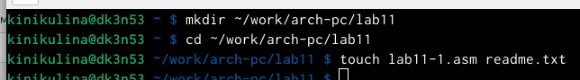
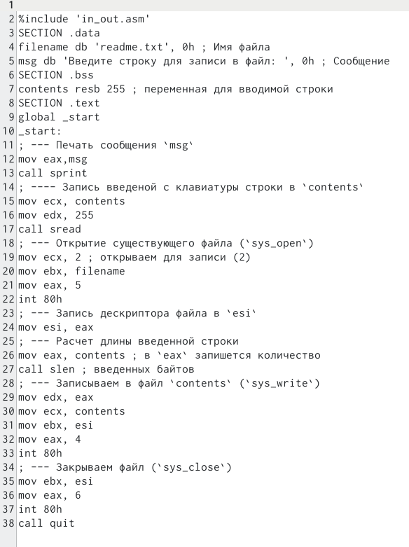
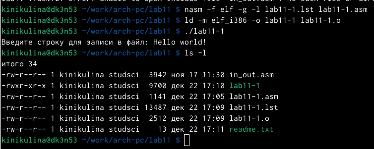
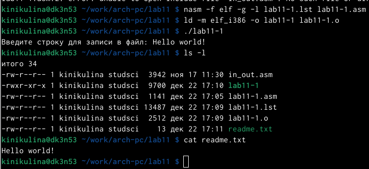
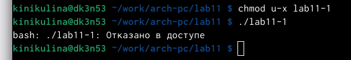
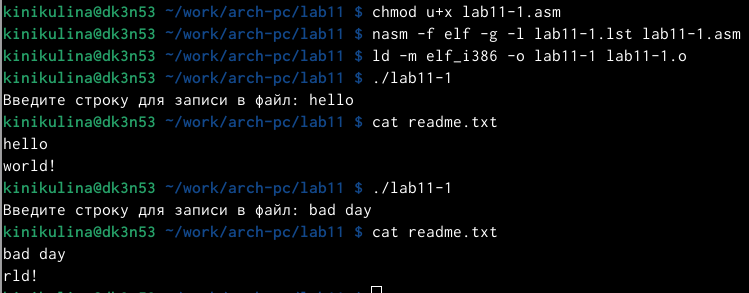
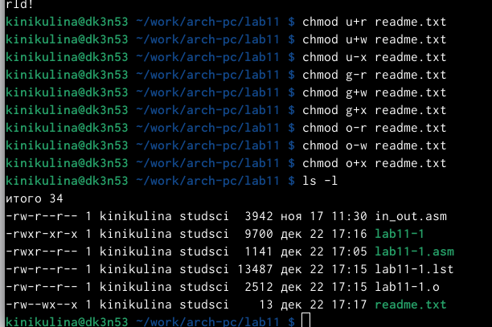
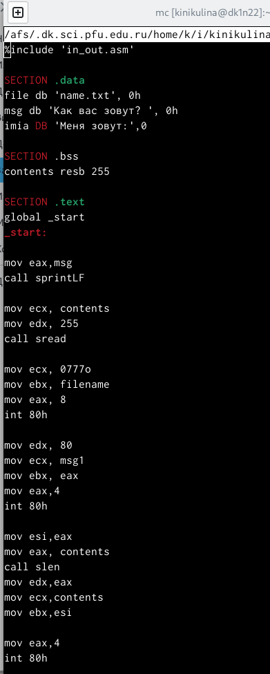
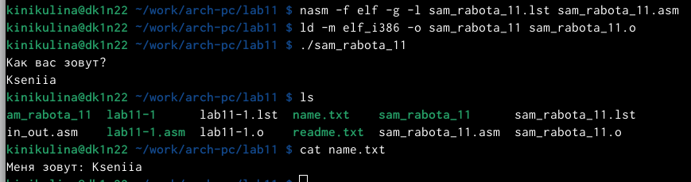

---
## Front matter
title: "Отчёт по лабораторной работе № 11"
subtitle: "Дисциплина: Архитектура компьютера"
author: "Никулина Ксения Ильинична"

## Generic otions
lang: ru-RU
toc-title: "Содержание"

## Bibliography
bibliography: bib/cite.bib
csl: pandoc/csl/gost-r-7-0-5-2008-numeric.csl

## Pdf output format
toc: true # Table of contents
toc-depth: 2
lof: true # List of figures
fontsize: 12pt
linestretch: 1.5
papersize: a4
documentclass: scrreprt
## I18n polyglossia
polyglossia-lang:
  name: russian
  options:
	- spelling=modern
	- babelshorthands=true
polyglossia-otherlangs:
  name: english
## I18n babel
babel-lang: russian
babel-otherlangs: english
## Fonts
mainfont: PT Serif
romanfont: PT Serif
sansfont: PT Sans
monofont: PT Mono
mainfontoptions: Ligatures=TeX
romanfontoptions: Ligatures=TeX
sansfontoptions: Ligatures=TeX,Scale=MatchLowercase
monofontoptions: Scale=MatchLowercase,Scale=0.9
## Biblatex
biblatex: true
biblio-style: "gost-numeric"
biblatexoptions:
  - parentracker=true
  - backend=biber
  - hyperref=auto
  - language=auto
  - autolang=other*
  - citestyle=gost-numeric
## Pandoc-crossref LaTeX customization
figureTitle: "Рис."
tableTitle: "Таблица"
listingTitle: "Листинг"
lofTitle: "Список иллюстраций"
lolTitle: "Листинги"
## Misc options
indent: true
header-includes:
  - \usepackage{indentfirst}
  - \usepackage{float} # keep figures where there are in the text
  - \floatplacement{figure}{H} # keep figures where there are in the text
---

# Теоретическое введение
ОС GNU/Linux является многопользовательской операционной системой. И
для обеспечения защиты данных одного пользователя от действий других поль-
зователей существуют специальные механизмы разграничения доступа к фай-
лам. Кроме ограничения доступа, данный механизм позволяет разрешить дру-
гим пользователям доступ данным для совместной работы.
Права доступа определяют набор действий (чтение, запись, выполнение), раз-
решённых для выполнения пользователям системы над файлами. Для каждого
файла пользователь может входить в одну из трех групп: владелец, член группы
владельца, все остальные. Для каждой из этих групп может быть установлен свой
набор прав доступа. Владельцем файла является его создатель. Для предостав-
ления прав доступа другому пользователю или другой группе командой
Тип файла определяется первой позицией, это может быть: каталог — d, обыч-
ный файл — дефис (-) или символьная ссылка на другой файл — l. Следующие
3 набора по 3 символа определяют конкретные права для конкретных групп:
r — разрешено чтение файла, w — разрешена запись в файл; x — разрешено
исполнение файл и дефис (-) — право не дано.
Для изменения прав доступа служит команда chmod, которая понимает как
символьное, так и числовое указание прав.

# Цель работы

Приобретение навыков написания программ для работы с файлами.

# Задание

1. Отработать запись данных в файл.
2. Отработать изменение прав доступа к файлам.
3. Выполнить задание для самостоятельной работы.

# Выполнение лабораторной работы

1. Я создала каталог для программам лабораторной работы № 11, перешла
в него и создала файл lab11-1.asm и readme.txt (рис. [-@fig:001])

{ #fig:001 width=70% }

2. Ввела в файл lab11-1.asm текст программы из листинга 11.1 (Программа
записи в файл сообщения). Создала исполняемый файл и проверила его
работу. рис. [-@fig:002]), рис. [-@fig:003]), рис. [-@fig:004])

{ #fig:002 width=70% }

{ #fig:003 width=70% }

{ #fig:004 width=70% }

3. С помощью команды chmod изменила права доступа к исполняемому файлу
lab11-1, запретив его выполнение. Попыталась выполнить файл и получила следующий результат, так как выполнение файла ограничено. (рис. [-@fig:005])

{ #fig:005 width=70% }

4. С помощью команды chmod изменила права доступа к файлу lab11-1.asm с
исходным текстом программы,добавив права на исполнение. Выполнила его, так как вернула права на исполнение.( рис. [-@fig:006]))

{ #fig:006 width=70% }

5. Предоставила права доступа к файлу readme.txt в соответствии с 8 вариантом в таблице 11.4.рис. Проверила правильность выполнения с помощью
команды ls -l. рис. [-@fig:007])

{ #fig:007 width=70% }

# Самостоятельная работа

1. Написала программу работающую по указанному алгоритму (рис. [-@fig:008]).

{ #fig:008 width=70% }

2. Создала исполняемый файл и проверила его работу. Проверила наличие файла
и его содержимое с помощью команд ls и cat. рис. [-@fig:009])

{ #fig:009 width=70% }

# Вывод

В ходе выполнения лабораторной работы были приобретены навыки написания программ для работы с файлами.
